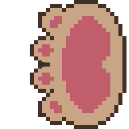

# CAT PONG

Este é um simples jogo de "Cat Pong" desenvolvido em HTML5, CSS3 e JavaScript. O jogo é baseado no clássico jogo Pong, mas com uma temática de gatos.

# Instruções de Jogo:

Objetivo do Jogo:

- Ganhe pontos rebatendo a bola de lã com as patas de gatos para o lado do oponente.

# Controles:

  

  

- Jogador 1 (à esquerda): Use as teclas "W" para mover a pata para cima e "S" para mover a pata para baixo.
Jogador 2 (à direita): Use as setas "Seta para cima" para mover a pata para cima e "Seta para baixo" para mover a pata para baixo.

Pontuação:

- Cada vez que a bola ultrapassa uma pata e atinge o lado oposto, o jogador adversário ganha um ponto.
A velocidade da bola aumenta a cada ponto marcado.

Divirta-se jogando Cat Pong! 🐾